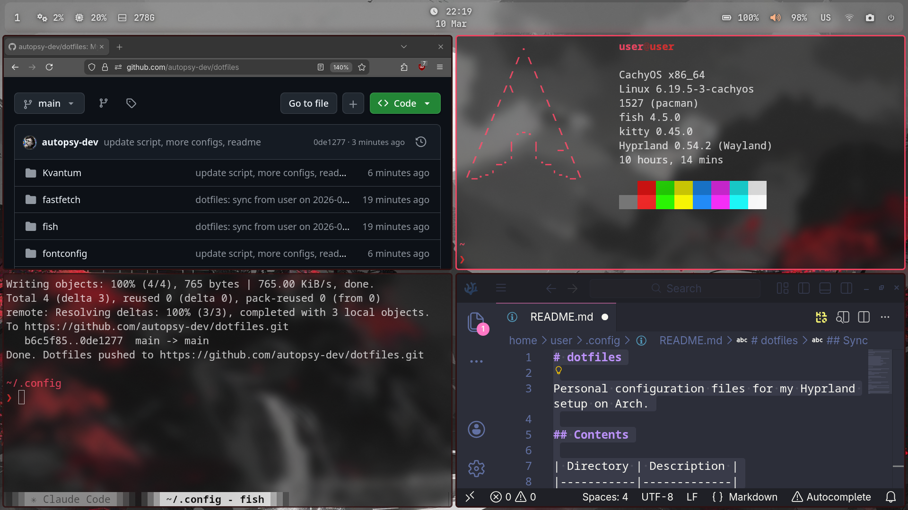

# dotfiles

Personal configuration files for my Hyprland setup on CachyOS.



## Contents

| Directory | Description |
|-----------|-------------|
| `hypr/` | Hyprland window manager config |
| `waybar/` | Status bar |
| `fish/` | Fish shell config |
| `kitty/` | Terminal emulator |
| `rofi/` | App launcher |
| `fastfetch/` | System info display |
| `swaylock/` | Screen locker |
| `wlogout/` | Logout menu |
| `mako/` | Notification daemon |
| `gtk-3.0/` | GTK3 theming |
| `gtk-4.0/` | GTK4 theming |
| `Kvantum/` | Qt/KDE theming |
| `qt5ct/` | Qt5 appearance |
| `fontconfig/` | Font rendering rules |

## Usage

`update-dotfiles.sh` handles both syncing and restoring configs:

```bash
./update-dotfiles.sh              # prompts for commit message
./update-dotfiles.sh "my message" # or pass it directly
```

- If a config directory exists in `~/.config/`, it is synced to the repo and pushed.
- If a config directory is **missing** from `~/.config/` but exists in the repo, it is automatically restored from the repo.

Requires a GitHub personal access token with `repo` scope — you'll be prompted on first run and the token is saved to `~/.config/.dotfiles_github_token`.
