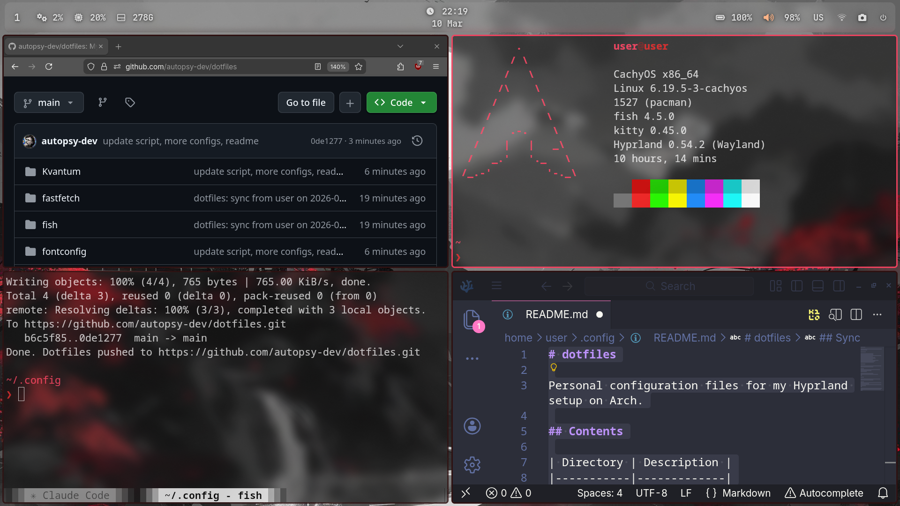

# dotfiles

Personal configuration files for my Hyprland setup on CachyOS.



## Contents

| Directory | Description |
|-----------|-------------|
| `hypr/` | Hyprland window manager config |
| `backgrounds/` | Wallpapers, including the dark cozy landscape and portrait images |
| `waybar/` | Status bar |
| `fish/` | Fish shell config |
| `kitty/` | Terminal emulator |
| `rofi/` | App launcher |
| `fastfetch/` | System info display |
| `swaylock/` | Screen locker |
| `wlogout/` | Logout menu |
| `mako/` | Notification daemon |
| `Kvantum/` | Qt/KDE theming |
| `qt5ct/` | Qt5 appearance |
| `fontconfig/` | Font rendering rules |
| `boot/` | Portable rEFInd Calm theme and graphical LUKS unlock installer |

## Graphical disk unlock and rEFInd

The `boot/` folder contains portable sources and theme assets. Syncing uploads
these files; restoring dotfiles downloads them without modifying the bootloader.
On a supported Arch/CachyOS machine with rEFInd already installed:

```bash
sudo python3 ~/.config/boot/install.py          # read-only detection and plan
sudo python3 ~/.config/boot/install.py --apply  # build, verify, back up and install
```

See [boot/README.md](boot/README.md) for requirements, restore instructions and
limitations. Disk identifiers and hardware settings are generated locally under
`/etc/graphical-unlock`; they are never copied into this repository. The source
check rejects identifiers, home-directory paths, credentials and build artifacts
in `boot/` before syncing it. This check covers the boot folder, not all desktop
configuration folders.

To publish only these boot sources and the shared README/install/sync scripts,
without uploading local desktop folders or screenshots:

```bash
./update-dotfiles.sh --boot-only "Add portable graphical unlock and rEFInd"
```

Boot-only commits use your GitHub handle and its noreply email address.

## Usage

To install the version currently on GitHub:

```bash
./install-dotfiles.sh
```

Requires `git` and `rsync`. The installer downloads the repository's default
branch and asks you to type `yes` before replacing the included config folders.
**This overwrites local changes, including changes not saved to GitHub, and
removes files absent from the repository inside those folders. Save unsaved
editor changes before running it.** Existing files are backed up under
`~/.config/dotfiles-backups/` (or `$XDG_CONFIG_HOME/dotfiles-backups/`). Other
config folders and existing Git checkouts are left alone. System packages are
not installed. Public repositories need no GitHub token; private repositories
can use your Git credentials, `GITHUB_TOKEN`, or the sync script's saved token.

The sync script uploads `backgrounds/`, and the installer checks that both
`dark-cozy-landscape.png` and `dark-cozy-portrait.png` are present before changing
your configs. Hyprland selects the appropriate wallpaper for each monitor when
you log in. This requires `swaybg` and Python 3. Run `update-dotfiles.sh` on the
configured PC first to publish the wallpaper files and updated scripts.

`update-dotfiles.sh` handles both syncing and restoring configs:

```bash
./update-dotfiles.sh              # prompts for commit message
./update-dotfiles.sh "my message" # or pass it directly
```

- If a config directory exists in `~/.config/`, it is synced to the repo and pushed.
- If a config directory is **missing** from `~/.config/` but exists in the repo, it is automatically restored from the repo.

Requires a GitHub personal access token with `repo` scope — you'll be prompted on first run and the token is saved to `~/.config/.dotfiles_github_token`.
