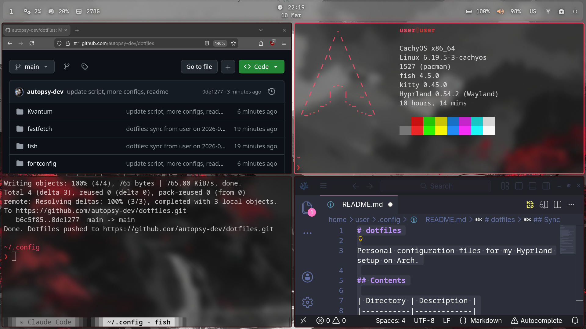

# dotfiles

Personal configuration files for my Hyprland setup on CachyOS.



## Contents

| Directory | Description |
|-----------|-------------|
| `hypr/` | Hyprland window manager config |
| `backgrounds/` | Wallpapers, including the dark cozy landscape and portrait images |
| `waybar/` | Status bar |
| `fish/` | Fish shell config |
| `kitty/` | Terminal emulator |
| `rofi/` | App launcher |
| `fastfetch/` | System info display |
| `swaylock/` | Screen locker |
| `wlogout/` | Logout menu |
| `mako/` | Notification daemon |
| `Kvantum/` | Qt/KDE theming |
| `qt5ct/` | Qt5 appearance |
| `fontconfig/` | Font rendering rules |
| `boot/` | Portable rEFInd Calm theme and graphical LUKS unlock installer |

## OpenAI usage widget

Waybar's `custom/openai` runs `waybar/modules/openai.py`, showing ChatGPT usage
and reset countdowns. Requires Python 3 and a ChatGPT login via `codex login`.
Credentials stay in `~/.codex/auth.json`; credentials and usage caches are not
part of these dotfiles. The logo font is bundled in `waybar/fonts/` and loaded
by `fontconfig/fonts.conf`. After installing, run `fc-cache -f` and restart Waybar.

See [waybar/modules/openai.README.md](waybar/modules/openai.README.md) for details.

## Graphical disk unlock and rEFInd

The `boot/` folder contains portable sources and theme assets. Syncing uploads
these files; restoring dotfiles downloads them without modifying the bootloader.
On a supported Arch/CachyOS machine with rEFInd already installed:

```bash
sudo python3 ~/.config/boot/install.py          # read-only detection and plan
sudo python3 ~/.config/boot/install.py --apply  # build, verify, back up and install
```

See [boot/README.md](boot/README.md) for requirements, restore instructions and
limitations. Disk identifiers and hardware settings are generated locally under
`/etc/graphical-unlock`; they are never copied into this repository. The source
check rejects identifiers, home-directory paths, credentials and build artifacts
in `boot/` before syncing it. This check covers the boot folder, not all desktop
configuration folders.

To publish only these boot sources and the shared README/install/sync scripts,
without uploading local desktop folders or screenshots:

```bash
bash ~/.config/dotfiles.sh update --boot-only "Add portable graphical unlock and rEFInd"
```

Boot-only commits use your GitHub handle and its noreply email address.

## Dotfiles wizard

Run the friendly menu to install from GitHub, upload this computer's configs,
or publish only the portable boot sources:

```bash
bash ~/.config/dotfiles.sh
```

### Install on a new computer with curl

Run as your **regular user**, not with `sudo`. Requires `curl`, `git`, and
`rsync`; desktop packages are not installed automatically.

```bash
curl -fsSL https://raw.githubusercontent.com/autopsy-dev/dotfiles/main/dotfiles.sh | bash
```

Choose **1 (Install / restore)**. The wizard downloads the repository's default
branch, shows what it will replace, and asks you to type `yes`. Prompts read
from your terminal, so they work even when the script is piped into Bash.
Public installs do not need a GitHub token.

**This runs code downloaded from GitHub.** For a safer review-first workflow:

```bash
curl -fSL https://raw.githubusercontent.com/autopsy-dev/dotfiles/main/dotfiles.sh -o dotfiles.sh
less dotfiles.sh
bash dotfiles.sh install
```

Existing configs, wizard scripts, and README are backed up under
`${XDG_CONFIG_HOME:-$HOME/.config}/dotfiles-backups/` before replacement.
Save open editor buffers first. Other config folders and existing Git checkouts
are left alone. The wizard installs itself in your config folder for next time.
Restart affected applications or log back into Hyprland afterward; boot settings
still require the separate, explicit boot installation described above.

The installer checks that the landscape and portrait wallpapers are present
before changing your configs. Hyprland selects the right wallpaper per monitor
when you log in; this requires `swaybg` and Python 3. The OpenAI logo font cache
is refreshed automatically when `fc-cache` is available.

### Upload changes

```bash
bash ~/.config/dotfiles.sh update "fixes"
bash ~/.config/dotfiles.sh update --boot-only "Update portable boot sources"
```

- Shows the source, destination, and folders, then asks before preparing an upload.
- If the checkout has uncommitted changes, offers to **stash tracked and new files**
  or cancel. No changes are discarded. The stash is retained, not automatically
  reapplied; checkout-only edits are not uploaded unless you copy them into your
  active config folder first.
- Pulls the latest repository version, syncs your active configs, shows the changes,
  and asks before committing and pushing. Missing local folders are restored from
  the checkout when available.
- Existing Git credentials work. Alternatively, enter a GitHub token when prompted
  and optionally save it with owner-only permissions. Tokens are not put in Git URLs.
- Review desktop configs for private data before uploading. The portable boot check
  scans the boot sources and shared scripts/README, **not all desktop folders**.

The old `./install-dotfiles.sh` and `./update-dotfiles.sh "message"` commands
still work as shortcuts to the same wizard. Config paths respect `XDG_CONFIG_HOME`;
`DOTFILES_DIR` overrides the upload checkout and `DOTFILES_REPO_URL` selects a
different repository. Run `bash ~/.config/dotfiles.sh --help` for usage.

**Publish the new wizard from the configured PC first** using the upload command
above. The curl command is available only after `dotfiles.sh` reaches GitHub.
